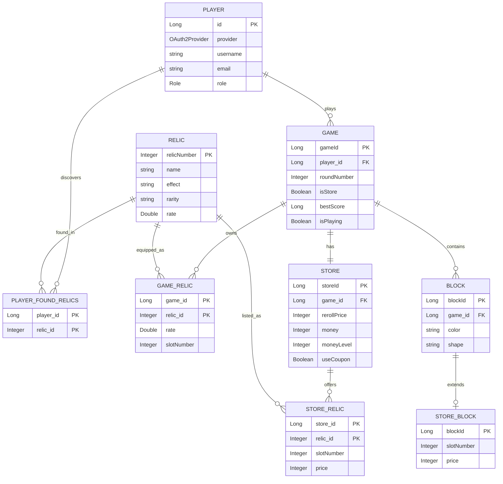

# TETRING — 테트리스 × 덱빌딩 웹 게임

> **한 줄 소개**
>
> 클래식 퍼즐 **테트리스**에 **덱빌딩 전략**을 결합해, 손맛과 전략을 동시에 느낄 수 있도록 설계한 웹 게임입니다.
> 라운드별 목표 점수를 달성하며, 상점에서 유물/블록을 조합해 시너지를 만드는 것이 핵심입니다.

  

---

## 스크린샷

   
  <em>플레이 화면 — 콤보·라운드 목표 UI</em>

   
  <em>상점 — 희귀도/중복 방지/리롤 인터랙션</em>

---

## 레파지토리

- **Backend (Spring Boot)**
  [테트링 백엔드](https://github.com/Bracket-team/tetring-backend)
  간단 설명: OAuth2 + Spring Security, Redis 기반 Refresh Token, JPA/MySQL.

- **Frontend (React)**
  [테트링 프론트엔드](https://github.com/Bracket-team/tetring-react)
  간단 설명: React 기반 클라이언트, 테트리스 플레이 및 인게임 UI 구현.

---

## 왜 만들었나
- 순발력 중심의 기존 테트리스에 **중·장기 의사결정의 재미**를 더해보고자 했습니다.
- “속도만 빨라지는 난이도” 대신, **라운드 목표 점수**와 **경제·상점 시스템**을 통해 다른 형태의 압박과 선택지를 제공하려 했습니다.
- 반복 플레이에서도 새로운 전략이 나오도록 **유물(효과) 중복 방지**, **희귀도 기반 확률**, **리롤(reroll)** 등을 설계했습니다.

---

## 핵심 컨셉
- **즉시성 × 전략성**: 조작은 그대로 가볍게, 점수 메타는 깊게.
- **선택의 의미**: 상점 구매/리롤/머니 레벨업 타이밍이 라운드 성과를 좌우.
- **가시성**: 점수·콤보·라운드 목표를 명확히 보여 주어, 플레이어가 스스로 전략을 수립하게.

---

## 주요 기능
- **라운드 목표 점수**: 각 라운드마다 달성해야 하는 목표가 있으며, 라운드가 올라갈수록 목표가 상승합니다.
- **스코어링**: 연속 라인 제거로 **콤보**를 쌓거나 다중 라인 제거로 **라인** 점수를 크게 올릴 수 있습니다.
- **유물(레릭) 시스템**: 희귀도에 따라 등장하며, **중복 방지**로 다양성과 조합의 재미를 유지합니다.
- **상점 & 리롤**: 재화를 사용해 유물/블록을 구매하거나, **리롤**로 목록을 갱신합니다.
- **머니 레벨 시스템**: 라운드/상황에 맞춰 **수입을 늘리는 레벨업**을 선택할 수 있습니다.
- **리더보드 & 도감**: 최고 점수를 기록하고, 발견한 유물을 **도감**으로 확인합니다.

---

## 시스템 한눈에 보기
- **클라이언트**: 브라우저 기반 플레이, 조작/시각화/인게임 UI, 테트리스 로직 구현
- **백엔드**: 점수 저장, 상점/유물 로직, 리더보드
- **데이터**: 유물 정의, 희귀도/가격/효과, 플레이 기록

> - React로 프론트엔드 기능 구현
> - Spring Boot를 사용해 백엔드 기능 구현
> - AWS EC2 + RDS를 통한 배포
> - Docker를 통한 배포 관리

---

## 데이터베이스 설계 (ERD)

게임 데이터를 9개 엔티티로 모델링했습니다. 플레이어·게임·유물·상점·블록을 핵심 엔티티로 두고, 다대다 관계는 연결 엔티티(`GAME_RELIC`, `STORE_RELIC`, `PLAYER_FOUND_RELICS`)로 분해했습니다. 각 연결 엔티티는 두 외래키를 묶은 복합 기본키를 사용하며, 블록은 `BLOCK`–`STORE_BLOCK` 상속(JPA JOINED) 구조로 설계했습니다.

> 연결 엔티티(`GAME_RELIC`, `STORE_RELIC`, `PLAYER_FOUND_RELICS`)의 두 PK 컬럼은 복합 기본키이자 외래키입니다.

---

## 개발 포인트 & 이슈 해결
- **밸런싱**
  - 초중반 과금 압박 완화, 후반 스노우볼 억제를 위해 **리롤 가격 곡선**과 **머니 레벨 수치**를 알파 테스트를 통해 여러 차례 조정했습니다.
  - 라운드 목표 점수 테이블을 재설계하여 “손맛”과 “전략”의 균형을 맞췄습니다.
- **성능/안정성**
  - 상점·유물 로직의 **중복 방지/확률 제어**를 일관성 있게 유지하도록 서버 검증 로직을 강화했습니다.
  - 로그인은 **Spring Security + OAuth2.0**으로 구현하고, **Refresh Token은 Redis**에 저장해 관리했습니다.
- **데이터 정합성**
  - 유물 구매처럼 여러 데이터가 함께 바뀌는 로직은 **트랜잭션(@Transactional)**으로 묶어 원자적으로 처리했습니다.
  - 같은 게임에 같은 유물이 중복 저장되지 않도록 **복합 기본키**로 DB 차원에서 차단했습니다.
- **품질 관리**
  - 테스트 플레이(알파)와 로그 관찰을 통해 **체감 난이도**와 **선호 빌드**를 파악하고 지표 기반으로 개선했습니다.

---

## 기술 스택
- **Frontend**: React
- **Backend**: Spring Boot, Spring Security (OAuth2.0), Spring Data JPA
- **Infra/DB**: MySQL (AWS RDS), Redis, Docker, AWS EC2
- **Collab**: Notion, Git

---

## 팀 & 역할
- **송하준** — **팀장** / 백엔드·DB 설계 총괄, 게임 로직 개발
- **박성우** — 프론트엔드, 게임 로직 개발
- **박재혁** — UI/UX

---

## 앞으로의 계획
- 신규 유물/시너지 추가 및 고난도 라운드 확장
- 플레이 데이터 기반 자동 밸런싱 실험
- 접근성/튜토리얼 개선

---
